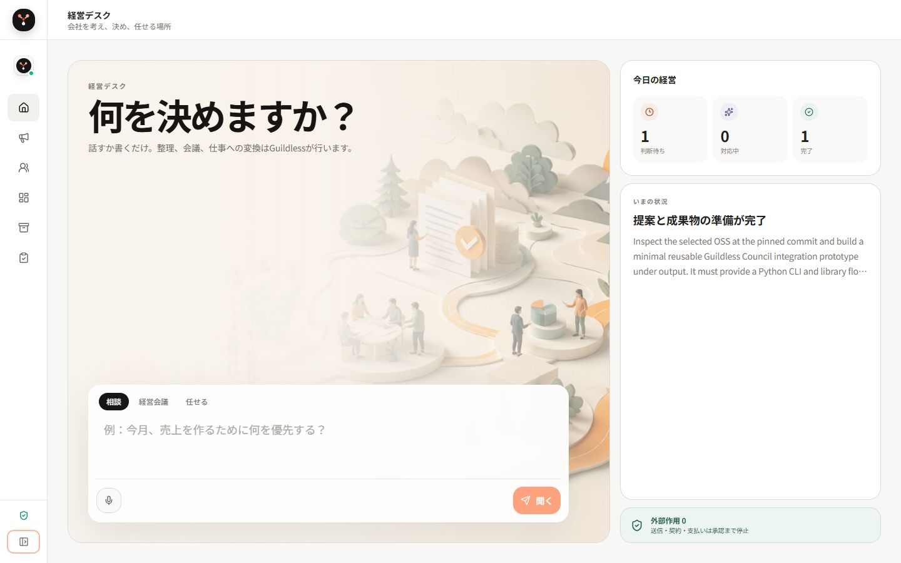

# Guildless

**会社を考え、決め、安全に仕事を任せるためのローカルファーストAI企業運営OS。**

Guildlessは、経営者の相談を整理し、必要なOSSをGitHubから調査し、複数AIの意見を比較し、成果物の実在まで検証します。モデル名や実行ログを主役にせず、経営者が最初に見るべき「判断待ち・対応中・完了」を中心に表示します。



## 置き場所

Guildlessの本体は **`D:\guildless`** ひとつだけです。編集・起動・コミットはすべてここで行います。

| 場所 | 中身 |
| --- | --- |
| `D:\guildless` | 本体（唯一の作業場所） |
| `D:\guildless\workspaces` | 仕事ごとの隔離作業ディレクトリ |
| `D:\guildless\runs` | 実行記録・監査ログ |
| `D:\guildless_archive` | 過去の複製・参照用OSS・バックアップ（読むだけ） |
| `D:\guildless_sim` | 別システム。Guildlessからのアクセスは禁止 |

## 現在できること

- **壁打ち**: DeepSeek、Codexなど利用可能なモデルで相談を整理
- **経営会議**: 独立提案、反論、Judgeを分離したCouncil
- **OSS選定**: GitHub候補をライセンス、更新状況、適合性で比較
- **仕事を任せる**: 調査、選定、隔離実装、テスト、成果物検証を一続きで実行
- **音声入力**: ブラウザ録音をローカルWhisperで文字起こし
- **監査**: provider、token、latency、根拠、状態遷移、外部作用を保存
- **安全停止**: Council出力は候補のまま保存し、確定方針へ自動昇格しない
- **営業・マーケ**: 4つのMIT OSSから営業段階、BANT/MEDDIC、会話分類、GTMチームを直接利用

## 1コマンド起動（Windows）

必要環境:

- Windows 10/11
- Python 3.11以上
- Node.js 22以上
- Git
- 任意: [Ollama](https://ollama.com/) と `deepseek-r1:14b`

```powershell
git clone https://github.com/kokoaru-ltd/guildless.git
cd guildless
powershell -ExecutionPolicy Bypass -File .\scripts\start_guildless.ps1
```

初回はPythonとUI依存関係を準備してから、`http://127.0.0.1:8780/guildless` を開きます。終了は起動したターミナルで `Ctrl+C` です。
営業・マーケOSSはGit submoduleとして固定commitを取得するため、初回起動時に自動セットアップされます。採用箇所と安全境界は [SALES_OSS_INTEGRATION.md](SALES_OSS_INTEGRATION.md) に記録しています。

2回目以降、依存関係を変更していない場合:

```powershell
powershell -ExecutionPolicy Bypass -File .\scripts\start_guildless.ps1 -SkipInstall
```

## ローカルLLM

無料のローカル実行はOllamaを使います。

```powershell
ollama pull deepseek-r1:14b
ollama serve
```

Guildlessは既定で `http://127.0.0.1:11434` を使います。外部モデルが利用不能でも、残りのモデルで `degraded` として継続し、失敗を成功扱いしません。

## 音声入力

「音声で話す」を押すとブラウザが録音し、ローカルの `faster-whisper` で文字へ変換します。録音データは外部APIへ送らず、一時ファイルは処理後に削除します。初回だけWhisperモデルの取得にネットワークを使います。

固定した上流版と詳細は [LOCAL_VOICE.md](LOCAL_VOICE.md) を参照してください。

## API / CLI

UIとCLIは同じorchestratorを使います。

```powershell
.\.venv\Scripts\python -m council doctor
.\.venv\Scripts\python -m council ask --mode local --task architecture --question "今月の営業優先順位を整理して"
```

主要API:

- `POST /v1/council/runs`
- `GET /v1/council/runs/{run_id}`
- `GET /v1/council/runs/{run_id}/events`
- `POST /v1/guildless/runs`
- `POST /v1/audio/transcriptions`
- `GET /v1/sales/overview`
- `POST /v1/sales/score`

詳しくは [HTTP_API.md](HTTP_API.md) と [AUTONOMOUS_JOBS.md](AUTONOMOUS_JOBS.md) を参照してください。

## 検証

```powershell
powershell -ExecutionPolicy Bypass -File .\scripts\verify_release.ps1
```

このコマンドはUIのproduction buildとPythonテストを実行します。

## データと権限の境界

- 入力として明示された `context` だけをCouncilへ渡します。
- `D:\guildless_sim` と `D:\founder_memory` への直接アクセスは禁止しています。
- `.env`、`runs/`、`.runtime/`、ローカルモデル、顧客データはGitへ含めません。
- 外部メール送信、契約、支払い、公開、顧客接触は明示承認なしに実行しません。
- Historical BenchmarkはGuildlessの行動で歴史を書き換える管理シミュレーターではありません。

## 構成

```text
council/      FastAPI、Council、provider、監査、実行制御
frontend/     React + TypeScriptの経営UI
scripts/      起動、ローカル音声、リリース検証
tests/        API、境界、実行、音声のテスト
third_party/  固定commitの上流コードと由来情報
```

## ライセンスと由来

Guildless固有コードは [MIT License](LICENSE) です。Cloudflare OS由来のUIパターンはApache-2.0、shadcn-adminとfaster-whisperはMITです。由来、固定commit、対象ファイルは [THIRD_PARTY_NOTICES.md](THIRD_PARTY_NOTICES.md) と [UI_SOURCES.md](UI_SOURCES.md) に記録しています。

## English

Guildless is a local-first AI company operating system for founders. It turns a goal into research, independent proposals, verified work and approval-gated outcomes. Clone the repository and run `scripts/start_guildless.ps1` on Windows. Telemetry and unapproved external actions are disabled by default.
