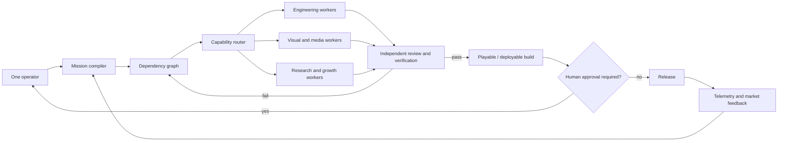

# GUILDLESS

> **One person. Full studio.**<br>
> One human directs. An AI production organization plans, builds, tests, ships, operates, and grows the product.

GUILDLESS is an open development project for testing a hard claim:

> Can one capable person ship and operate software or a game that previously required a full development organization?

This is not another multi-model chat UI and not a claim that current AI can autonomously create an AAA game. GUILDLESS is the control plane required to turn many imperfect, replaceable AI models into a persistent production organization with budgets, memory, verification, and human accountability.

**日本語:** 1人のオーナーが目標・品質・予算・重要判断を担当し、AI組織が企画、実装、素材制作、テスト、リリース、保守、マーケティングを進めるための実証プロジェクトです。

## The honest answer: is this possible?

### Possible with current technology

- One person shipping production SaaS, web, mobile, and internal products with dramatically less implementation labor
- One person producing an indie or carefully scoped mid-size game using an existing engine
- Parallel code, test, documentation, research, visual, video, and campaign production
- Continuous maintenance where low-cost agents triage telemetry and prepare verified fixes
- Human-controlled releases with automated builds, regression tests, budgets, and rollback

### Not solved yet

- A fully autonomous AAA/MMO production with no experienced human oversight
- Months of reliable agent work without architectural drift or supervision
- Consistently production-ready 3D characters, rigs, animation, level design, and game balance from prompts alone
- Proving subjective quality—fun, taste, story, brand, and market fit—with deterministic tests
- Giving agents unrestricted production access without unacceptable security risk

The project succeeds only if it closes these gaps through reproducible builds and measurable benchmarks. A polished demo does not count.

The current external-agent and Skill research, procurement rules, differentiation,
and implementation order are documented in
[`docs/research/agent-skill-intelligence-2026-07.md`](docs/research/agent-skill-intelligence-2026-07.md).

## Why now?

Individual models already perform valuable pieces of a studio's work. The missing layer is organizational:

- models forget decisions or lose context;
- parallel agents conflict with each other;
- generated work is often not verified;
- token usage is optimized instead of completed-product cost;
- destructive actions and releases need explicit authority;
- creative assets must enter real editable pipelines, not end as disconnected images;
- production must continue when a provider changes price, limits, or model availability.

GUILDLESS treats models as replaceable engines and owns the durable production state around them.

## What the operator does

The single human is the founder, product owner, and creative director—not a ticket dispatcher.

1. Define the outcome, audience, constraints, budget, and deadline.
2. Establish taste through references and approve product-defining decisions.
3. Review playable or usable builds instead of reading every generated line.
4. Approve expensive, destructive, security-sensitive, and production actions.
5. Decide whether real users justify the next milestone.

Everything else should become delegable, observable, reversible, and testable.

## Full production loop



## Capability routing

The following are initial policies, not permanent vendor choices. Routing must eventually use measured quality, completion cost, latency, privacy, context requirements, and availability.

| Studio capability | Candidate engines | Output—not just a response |
| --- | --- | --- |
| Architecture and implementation | Claude, Codex, strong coding models | reviewed commits, migrations, tests, builds |
| Visual production | GPT Image and specialist image models | editable source, sprites, textures, UI, store assets |
| Low-cost operations | Kimi and efficient open models | classified incidents, verified patches, runbooks |
| Large-context and multimodal analysis | Gemini and comparable models | repository/media analysis, test evidence, decisions |
| Motion and campaign media | Seedance and available video models | trailers, ads, cinematics, cut-down variants |
| Marketing and growth | best model per channel and task | positioning, experiments, campaigns, measured results |

Provider names never appear in mission logic. Each integration implements a capability contract so engines can be benchmarked and replaced.

## Software production

For a software mission, GUILDLESS must be able to:

- turn an owner directive into specifications, architecture decisions, milestones, and acceptance tests;
- create an explicit dependency graph instead of an unbounded chat plan;
- give agents isolated branches/worktrees and least-privilege tools;
- prevent two workers from silently changing the same contract;
- run tests, static analysis, security checks, migrations, and preview deployments;
- use an independent reviewer rather than allowing the author to approve its own output;
- merge only verified artifacts and preserve provenance;
- deploy behind an approval gate and automatically roll back failed releases;
- convert production incidents and user feedback into repair missions.

## Game production

For a game mission, writing code is only one part of the work. A valid pipeline must cover:

- game design documents, mechanics, progression, economy, narrative, and content graphs;
- Unity, Unreal, or Godot projects with reproducible editor and headless builds;
- source-controlled scenes, prefabs, materials, shaders, VFX, and data tables;
- concept art through production-ready 2D/3D asset ingestion;
- rigging, animation, audio, dialogue, localization, and platform constraints;
- bot-driven playtests, deterministic simulations, save compatibility, and performance budgets;
- playable daily builds—not screenshots or design documents;
- Steam/store assets, trailers, community content, launch experiments, telemetry, and live operations.

Generated assets only count when they are licensed, traceable, editable, integrated into the game, and validated in a real build.

## Core architecture

The detailed, implementation-level design is in
[`docs/control-plane-spec.md`](docs/control-plane-spec.md). It defines durable
execution, the event ledger, versioned work graphs, scheduling, engine routing,
artifact/evidence contracts, independent review, authority grants, budget
reservation, failure recovery, operations, security, and the test gates that
must pass before the product can claim solo large-scale development.

| Component | Responsibility |
| --- | --- |
| Mission compiler | Convert intent into milestones, tasks, dependencies, tests, and budgets |
| Product memory | Preserve specifications, architecture decisions, taste, history, and provenance |
| Studio scheduler | Lease ready work, manage concurrency, retries, deadlines, and spend |
| Capability router | Select and fall back between model/tool providers |
| Isolated workers | Execute with scoped repositories, engines, media tools, browsers, or cloud access |
| Critics | Review artifacts independently of the producing worker |
| Verification system | Run deterministic tests, builds, simulations, visual checks, and security gates |
| Integrator | Merge compatible verified outputs and produce release candidates |
| Approval gateway | Pause product-defining, expensive, destructive, or irreversible actions |
| Operations loop | Turn telemetry, incidents, reviews, and campaign results into new missions |

More detail: [`docs/architecture.md`](docs/architecture.md)

Sakana Fugu baseline tracking: [`docs/fugu-baseline.md`](docs/fugu-baseline.md)

## Safety and authority

Autonomy without authority boundaries is a production incident waiting to happen.

- Agents receive capabilities per task, not permanent administrator access.
- Secrets stay outside prompts and artifacts.
- Network, filesystem, cloud, publishing, and spending permissions are separate grants.
- Destructive operations require a preview of the exact impact and human approval.
- Production changes require evidence, a rollback plan, and audit history.
- Monthly and per-task budgets are hard limits, not advisory UI.
- Model output is untrusted until verified.

## Proof, not promises

The first serious benchmark is a **90-day solo production trial**.

### Target

One operator releases and operates either a production SaaS product or a commercial-quality game vertical slice.

### Required evidence

- at least 100,000 maintained source lines or an equivalent multi-asset game project;
- reproducible daily builds for 30 consecutive days;
- automated regression, security, and recovery checks;
- at least 10 concurrent isolated workers without corrupting the main project;
- recovery from intentionally injected build, dependency, migration, and provider failures;
- less than one hour of mandatory operator intervention per day after stabilization;
- an enforced compute budget with per-artifact cost reporting;
- release, rollback, incident response, and post-release improvement from real telemetry.

### Failure conditions

The hypothesis is not validated if:

- the operator spends most of the day repairing agent output;
- output volume rises but releasable progress does not;
- architectural consistency collapses as the repository grows;
- manual asset cleanup recreates a conventional studio workload;
- compute cost approaches the equivalent human team cost;
- the system cannot safely survive model or provider replacement.

## Delivery roadmap

### Phase 0 — Control-plane prototype (current)

- [x] Mission-control interface
- [x] Provider-independent capability registry
- [x] Mission, task, acceptance-test, and approval contracts
- [x] Initial architecture and falsifiable benchmark
- [ ] Persistent mission database and event log

### Phase 1 — Verified software loop

- [x] Compile one mission into a dependency graph
- [x] Enforce cross-provider testing, review, and repair
- [x] Fail closed when an independent provider is unavailable
- [x] Block release without deterministic evidence and rollback plan
- [ ] Run multiple coding agents in isolated git worktrees
- [ ] Execute tests and independent review
- [ ] Merge only passing changes
- [ ] Enforce budget and approval policy
- [ ] Produce a deployable build and rollback evidence

### Phase 2 — Production operations

- [ ] Telemetry ingestion and incident classification
- [ ] Low-cost maintenance routing
- [ ] Automated repair PRs with evidence
- [ ] Release, rollback, and audit history
- [ ] Provider outage and fallback drills

### Phase 3 — Game and media studio

- [ ] Engine project adapter and headless build pipeline
- [ ] Asset manifest, rights, provenance, and editable-source tracking
- [ ] Image, 3D, audio, animation, and video production adapters
- [ ] Bot playtesting and performance capture
- [ ] Store page, trailer, campaign, and community workflow

### Phase 4 — Solo-production benchmark

- [ ] Run the public 90-day trial
- [ ] Publish cost, intervention time, failures, and release evidence
- [ ] Compare against a conventional project baseline
- [ ] Decide honestly whether the core hypothesis passed

## Repository status

This repository is currently an **architecture and mission-control prototype**. It does not yet execute autonomous production and should not be represented as a finished agent platform.

Implemented contracts live in:

- [`core/model-registry.ts`](core/model-registry.ts)
- [`core/production-contract.ts`](core/production-contract.ts)
- [`docs/architecture.md`](docs/architecture.md)
- [`orchestrator/planner.mjs`](orchestrator/planner.mjs)
- [`orchestrator/policy.mjs`](orchestrator/policy.mjs)

Generate the first cross-model production plan:

```bash
npm run guildless -- plan examples/missions/first-vertical-slice.json
npm run guildless -- engines
```

The generated plan is rejected unless implementation, test authoring, review, and repair are separated across providers. Local builds and tests act as deterministic verifiers; model agreement alone can never release a product.

## Run locally

Requirements: Node.js 22.13 or newer.

```bash
npm install
npm run dev
```

Production validation:

```bash
npm run build
```

### iPhone mission-control prototype

The Expo app visualizes one-person production: mission progress, model assignment, cross-provider review, approval gates, and accepted artifacts.

```bash
cd apps/mobile
npm install
npm start
```

Open the QR code with Expo Go on an iPhone connected to the same network. The prototype currently uses demonstration state; it is intentionally not presented as a live orchestrator client yet.

## Contributing

The most valuable contributions are not additional agent personas. They are repeatable integrations and tests that reduce required human intervention:

- isolated worker execution;
- task dependency and conflict detection;
- provider adapters with cost and quality telemetry;
- deterministic software and game-engine verification;
- asset provenance and editable-pipeline support;
- adversarial security and recovery benchmarks.

Open an issue with a concrete failure mode, proposed acceptance test, and reproducible example.

## License

The source is visible for research and validation. A formal open-source license has not yet been selected; until then, normal copyright restrictions apply. Do not describe the repository as open source yet.
